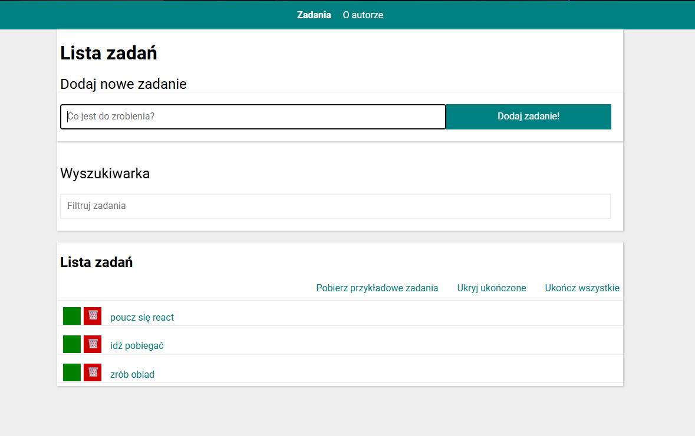

# React ToDo List ✅



A simple task management application built with **React**.

This project was created to practice the core concepts used in React applications such as component structure, state management, routing, and handling user interactions.

---

## Live Demo

👉 https://sebastianjuszczynski.github.io/Todos-list-react/

---


# Project Overview

The goal of this project was to strengthen fundamental frontend development skills by building a practical React application.

While working on this project I focused on:

- building reusable React components  
- managing application state  
- handling user input and events  
- rendering dynamic lists  
- implementing simple routing  
- creating a clean and user-friendly interface  

---

# Features

- Add new tasks  
- Delete tasks  
- Mark tasks as completed  
- Dynamic rendering of tasks  
- Simple routing using **React Router**  
- Clean and minimal UI  

---

# Tech Stack

### Frontend

<p>

</p>

### Libraries

- React Router

### Tools

<p>

</p>

---

# Installation

Clone the repository

```bash
git clone https://github.com/sebastianjuszczynski/Todos-list-react.git
```

Navigate to the project directory

```bash
cd Todos-list-react
```

Install dependencies

```bash
npm install
```

Start the development server

```bash
npm start
```

Open in browser

```
http://localhost:3000
```

---

# What I Learned

During the development of this project I improved my understanding of:

- React component structure  
- managing state in React  
- working with lists and keys  
- handling events in React  
- basic routing with React Router  
- structuring a small React application  

---

# Possible Future Improvements

Possible improvements for this project include:

- editing existing tasks  
- filtering tasks (active / completed)  
- saving tasks in localStorage  
- adding animations and improved UI  

---

# Author

Sebastian Juszczyński

Frontend developer focused on building modern web applications with **JavaScript and React**.

GitHub  
https://github.com/sebastianjuszczynski
